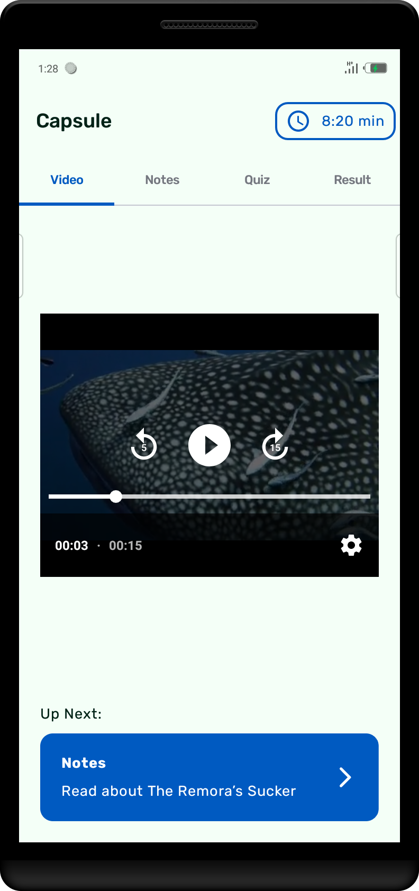
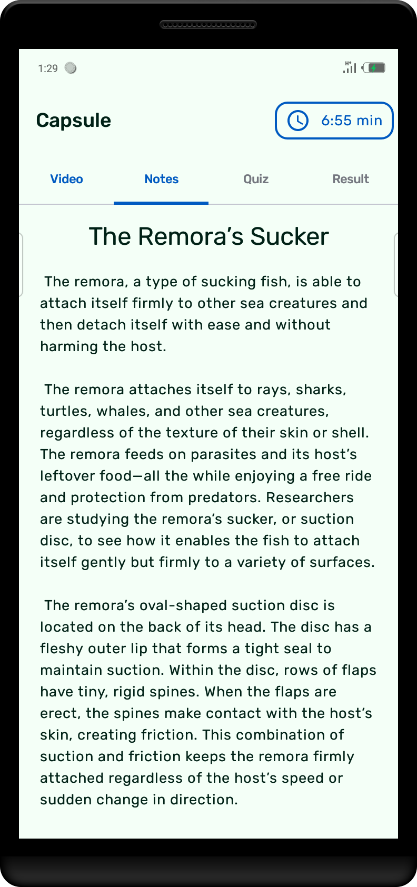
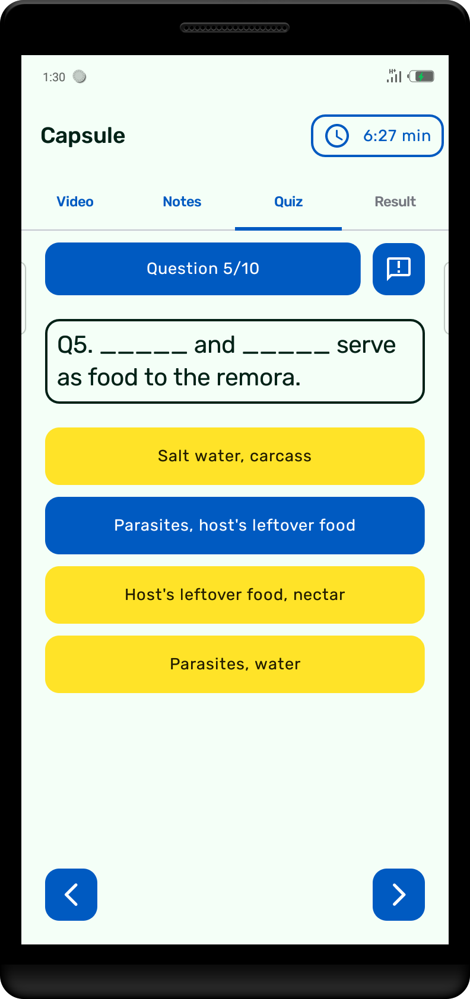
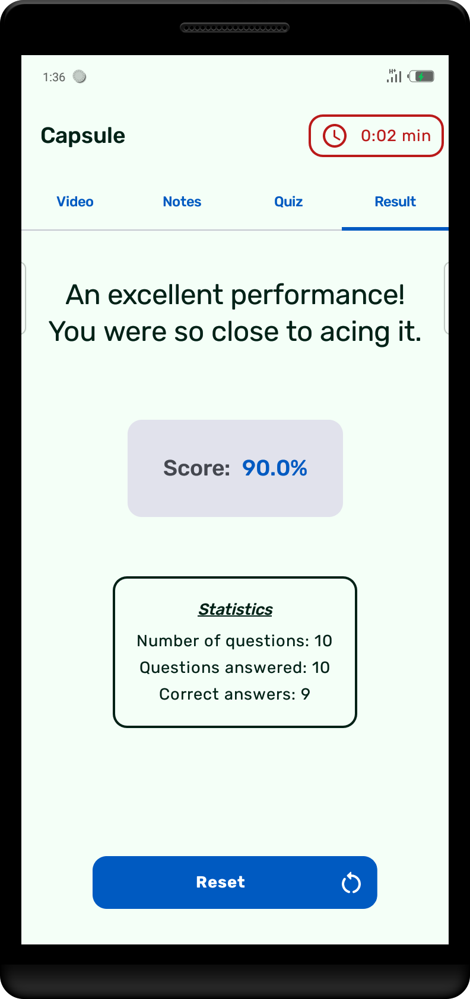

# Capsule
A quiz app.

Based on a challenge

## Screenshots
|::::::::::::::::::::::::::::::::::::::::|::::::::::::::::::::::::::::::::::::::::|::::::::::::::::::::::::::::::::::::::::|::::::::::::::::::::::::::::::::::::::::|::::::::::::::::::::::::::::::::::::::::|
|:--:|:--:|:--:|:--:|:--:|
||||||

## About
* The app shows a video, then a note (discussing more on the video).
* After which, the user is presented with a set of questions from either the video, note or general knowledge.
* The user starts with a 10 minutes countdown and is expected to finish the quiz (all screens) within the allotted time.
* Users also get to see their performance either after submitting their answers, or when the countdown is done. Then they will be given the opportunity to reset and restart the process.

* This project follows the MVVM structure with Clean Architecture.

    There are three _modules_ in the project:

    `app` - The user interface and communication layer. The main module

    `domain` - An android library housing the entities and use-cases

    `data` - Responsible for creating and managing data

## Developed with
* [Jetpack Compose](https://developer.android.com/jetpack/compose) - Jetpack Compose is Android’s recommended modern toolkit for building native UI.
* [Media3](https://developer.android.com/guide/topics/media/media3) - Enables Android apps display rich audio and visual experience.
* [Dagger-Hilt](https://developer.android.com/training/dependency-injection/hilt-android) - Reduces boilerplate of doing manual dependency injection in your project.
* [Material3](https://m3.material.io) - Google's latest design system with adaptable components and tools that support the best practices of user interface design for building beautiful apps.
* [Kotlin Coroutine](https://kotlinlang.org/docs/coroutines-overview.html) - For executing tasks asynchronously.
* [Stateflow](https://developer.android.com/kotlin/flow/stateflow-and-sharedflow) - An observable state-holder that emits data stream to its collectors - updating the UI incessantly.
* [ViewModel](https://developer.android.com/topic/libraries/architecture/viewmodel) - Stores UI-related data that isn't destroyed on UI changes.